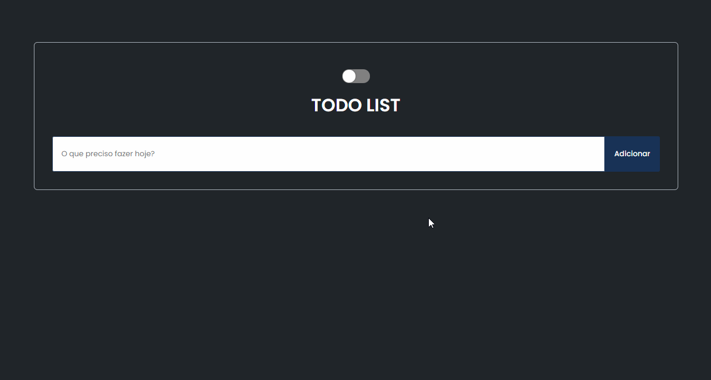

# Todo List - React

Aplicação Todo List constrída com ReactJS e Styled Components. Utiliza o localstorage para guardar as tarefas do usuário, e com a funcionalidade de Theme do Styled Components é possível trocar o esquema de cores, e a aplicação respeita a preferencia do usuário, iniciando em dark ou light mode de acordo com o sistema.

## ✨ Preview

## 🛠 Builded with

##  About me

- 👤 Bacharel em jornalismo se aventurando pelo mundo da programação, estudando stacks relacionadas ao front-end, focado em ReactJS

- 🔭 Me encontre:  
